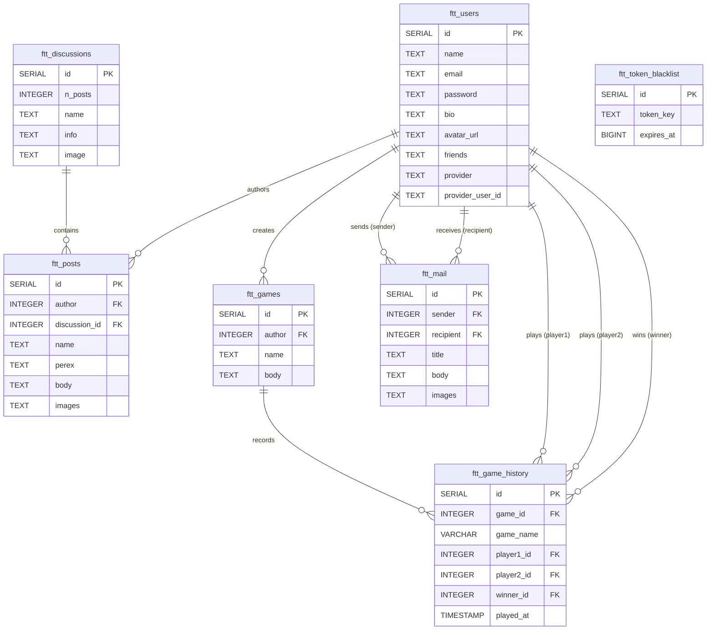

*This project has been created as part of the 42 curriculum by nspalevi, rludik, rnovotny, voparkan.*

# ft_transcendence BBS

## Description
**ft_transcendence** (FT_BBS - Forty-Two Bulletin Board System) is a full-stack web application inspired by the nostalgic Bulletin Board Systems (BBS) and classic UNIX terminal interfaces of the 1980s. Designed with a retro ASCII terminal user interface, the platform allows users to create accounts, customize profiles, connect with friends, send private direct mail, participate in community discussion boards, and play real-time multiplayer retro games directly in the browser.

The project is architected with a high-performance **Rust (Actix-web)** backend, a **PostgreSQL** database managed via **Diesel ORM**, a **React 19 + TypeScript + Vite** frontend, an **Nginx** reverse proxy, and a WebAssembly-powered Lua game execution sandbox (**Wasmoon**).

## Instructions

### Prerequisites

#### Core System & Containerization
- **Docker Engine** (v20.10+ recommended) & **Docker Compose** (v2 `docker compose` or legacy v1 `docker-compose`) for running the multi-container microservices stack (PostgreSQL 17, Actix-web server, and Nginx frontend).
- **GNU Make** (recommended) for running single-command stack management targets (`make up`, `make down`, `make logs`, `make full`, `make fclean`).

#### Environment Configuration (`.env` Setup)
Before starting the application, ensure the backend environment configuration file (`server/.env`) exists. Initialize it by copying the template file:
```sh
cp server/.env.example server/.env
```
*(Alternatively, run the automated setup script: `./tools/setup-env.sh`)*

The environment variables configured in `server/.env` are:
| Variable | Description |
|---|---|
| `DATABASE_URL` | PostgreSQL connection string *(overridden in Docker Compose to target `db:5432`)* |
| `DATABASE_PASSWORD` | PostgreSQL database password |
| `SECRET_HASH` | Secret key used for password hashing and signing OAuth state cookies |
| `JWT_HASH` | Secret key used for signing and verifying JWT session tokens |
| `OAUTH_REDIRECT_BASE` | Base origin URL for browser redirects after OAuth login *(default: `https://localhost`)* |
| `OAUTH_42_CLIENT_ID` / `_SECRET` | Client ID and secret for 42 Intra OAuth2 authentication |
| `OAUTH_GOOGLE_CLIENT_ID` / `_SECRET` | Client ID and secret for Google OAuth2 authentication |
| `OAUTH_GITHUB_CLIENT_ID` / `_SECRET` | Client ID and secret for GitHub OAuth2 authentication |

#### Optional Local Development Tooling
To run local non-containerized development server, tests, or code checks directly on your host system (or when executing `make full`):
- **Node.js** (v22+ or v24+, see `.nvmrc`) & **npm** (v10+): Required for frontend package installation (`npm ci`), development server (`npm run dev`), SPA bundle build (`npm run build`), ESLint (`npm run lint`), and Vitest (`npm test`).
- **Rust Toolchain** (v1.95.0, Edition 2021) & **Cargo**: Required for local backend compilation and syntax verification (`cargo check`).
- **PostgreSQL 17 Client Libraries (`libpq`) & C Build Tools**: Required if compiling the backend natively outside Docker (`pq-sys`, `openssl-sys`).

---

### Installation & Execution

#### 1. Configure Environment
Initialize the environment configuration file:
```sh
cp server/.env.example server/.env
```
Add configuration values to `.env` file.

#### 2. Launch the Application
Run the full stack with a single command from the repository root:
```sh
make up
```
*Alternatively, invoke Docker Compose directly:*
```sh
docker compose up --build -d
```
*(For workstations with legacy Compose v1: `docker-compose up --build -d`)*

#### 3. Access Points & Seeded Accounts
Once containers are running, access the services:
- **Web Interface (Frontend):** [http://localhost:443](http://localhost:443)
- **REST API Backend:** [http://localhost:443/api](http://localhost:443/api) (via Nginx proxy at `http://localhost:443/api`)
tests for api rate limit: `python3 tests/rate_limit_test.py`


Default seeded test accounts created on backend startup (if they do not already exist):

| Username | Password | Role |
|---|---|---|
| `test` | `test` | Standard User |
| `admin` | `admin` | Administrator |
| `guest` | `guest` | Guest User |

#### 4. Stack Management Commands
Below are the GNU Make shortcut commands available for managing the project stack:

| Command | Action |
|---|---|
| `make up` | Build Docker images and start all containers in detached mode |
| `make logs` | Stream live combined logs from all containers (`docker compose logs -f`) |
| `make ps` | List running container status and port mappings (`docker compose ps`) |
| `make build` | Rebuild Docker container images (`docker compose build`) |
| `make down` | Stop and remove running containers (`docker compose down`) |
| `make full` | Install local dependencies (`npm ci`), run backend checks (`cargo check`), build frontend assets (`npm run build`), run frontend linter (`npm run lint`), and build Docker images |
| `make fclean` | Stop containers, remove volumes (`--volumes`), delete local images (`--rmi local`), remove orphaned containers, and purge local build artifacts (`frontend/node_modules`, `frontend/dist`, `server/target`) |


## Resources

### Technology Documentation & References
- **Rust & Actix-web**: [Actix-web Documentation](https://actix.rs/docs/) & [The Rust Programming Language Book](https://doc.rust-lang.org/book/)
- **Diesel ORM**: [Diesel Getting Started Guide](https://diesel.rs/guides/)
- **PostgreSQL**: [PostgreSQL 17 Official Manual](https://www.postgresql.org/docs/17/index.html)
- **React & TypeScript**: [React 19 Documentation](https://react.dev/) & [TypeScript Handbook](https://www.typescriptlang.org/docs/)
- **Vite Tooling**: [Vite Guide](https://vite.dev/guide/)
- **Wasmoon (Lua WASM)**: [Wasmoon GitHub Repository](https://github.com/ceifa/wasmoon)
- **Docker & Compose**: [Docker Compose Documentation](https://docs.docker.com/compose/)
- **Nginx**: [Nginx Beginner's Guide](https://nginx.org/en/docs/beginners_guide.html)

### AI Usage
Artificial Intelligence tools (LLMs and AI coding assistants) were used throughout the development process for several key tasks:
- **Boilerplate Generation:** Generating initial boilerplate code for React components, Actix-web route handler signatures, and Diesel migration files.
- **Documentation & README Drafting:** Structuring and drafting project documentation, architectural overviews, database schema definitions (Mermaid ER diagrams), and section summaries.
- **Learning New Technologies:** Accelerated learning curves for unfamiliar tools, such as embedding WebAssembly Lua sandboxes (`wasmoon`), configuring `actix-security` authentication pipelines, and writing compile-time validated Diesel ORM queries.
- **Troubleshooting & Debugging:** Diagnosing compiler errors, analyzing stack traces, debugging WebSocket lobby state synchronization, and optimizing multi-stage Docker container builds.
- **Pull request reviews:** Copilot was used to provide suggestions and improvements for pull requests.

## Team Information
| Name      | Role(s)              | Responsibilities                |
|-----------|----------------------|---------------------------------|
| nspalevi  | PM, Developer        | meetings, deadlines             |
| rludvik   | Developer            | development, testing            |
| rnovotny  | PO, Developer        | PRD, backlog, documentation     |
| voparkan  | Tech Lead, Developer | architecture, technical details |

## Project Management
### Organization
- Initial product vision was created by the PO, with specific tech details added by the Tech Lead. The PM created tasks from this description and the team members chose tasks to work on.
- Weekly to biweekly standups were held to discuss progress and any issues encountered. The date of the next meeting was decided at the end and posted to Slack by the PM.

### Tools
- A Github repository was used to store the code and a GitHub project was used to organize work.
- A Kanban board in Github was used to track issues. Issues were moved from the *Backlog* column to the *Ready* column, and when someone started working on an issue, they moved it to the *In progress* column.
- After completing work on an issue, a PR was created in GitHub and the issue was moved to the *In review* column. Other team members provided feedback and comments and when they approved the PR, the issue was moved to the *Done* column and marked completed.


### Communication
- Slack was used for messaging, planning and organizing meetings.
- After some issues with Slack's voice chat, Discord was used for online meetings.

## Technical Stack
### Frontend
- **React 19** (`react`, `react-dom`) - Client-side component UI framework.
- **TypeScript 6** - Strict type safety and developer tooling.
- **Vite 8** - Next-generation frontend build tool and development server with `@vitejs/plugin-react`.
- **React Router DOM 7** (`react-router-dom`) - Declarative Single-Page Application (SPA) routing.
- **Wasmoon** (`wasmoon` 1.16) - WebAssembly-compiled Lua 5.4 engine for client-side game logic execution.
- **Vanilla CSS** - Retro UNIX BBS / ASCII terminal custom design system with responsive full-width window mode (`index.css`).
- **Vitest & JSDOM** - Frontend unit and integration testing environment.
- **ESLint 10** - Code quality enforcement and static analysis for React and TypeScript.

### Backend
- **Rust (Edition 2021 / 1.95.0)** - Memory-safe, high-performance system programming language.
- **Actix-web 4** - Asynchronous web framework powering high-concurrency REST API endpoints.
- **Actix-ws** (`actix-ws` 0.3) - Low-latency WebSocket handler for real-time multiplayer lobbies and games.
- **Actix-security & Actix-session** - Authentication framework supporting Argon2 password hashing (`Argon2PasswordEncoder`), OAuth2 single sign-on (42 Intra, Google, GitHub), JWT token pair rotation, database token blacklisting (`ftt_token_blacklist`), and cookie session management.
- **Serde & Serde JSON** - High-performance data serialization and deserialization.
- **Dotenvy & Env Logger** - Environment variable management and structured logging.

### Database
- **PostgreSQL 17** (`postgres:17.10-trixie`) - Relational database management system running in a dedicated Docker container with persistent volume storage.
- **Diesel 2.2** (`diesel`, `diesel_migrations`) - Type-safe ORM and query builder for Rust with automated schema migrations.
- **Justification**: PostgreSQL delivers strong ACID compliance, robust relational data integrity (critical for user profiles, posts, discussions, mail, match history, and OAuth identities), and high concurrent query performance. Diesel guarantees compile-time validation of all SQL queries against the schema, preventing runtime query errors and SQL injection vulnerabilities.

### Other Technologies
- **Docker & Docker Compose v2** - Containerization platform managing multi-stage container builds with active container healthchecks (`/health`).
- **Nginx 1.29** (`nginx:1.29-alpine`) - Reverse proxy server routing static SPA assets, `/api/` HTTP requests, and WebSocket connections with self-signed SSL/TLS support.
- **GNU Make** - Development automation tool (`Makefile`) for single-command stack management (`make up`, `make down`, `make full`, `make fclean`, `make logs`).

### Technical Choices
- **Rust + Actix-web**: Chosen for zero-cost abstractions, memory safety without garbage collection overhead, and high-performance async execution needed for real-time game interactions.
- **OAuth2 Multi-Provider SSO**: Allows seamless user authentication via 42 Intra, Google, and GitHub without exposing client secrets to the browser.
- **Diesel ORM**: Ensures compile-time checking of SQL queries against the PostgreSQL schema, catching structural mismatches before runtime.
- **React 19 + TypeScript + Vite**: Provides strict type safety, fast HMR during development, and small production bundle sizes.
- **Wasmoon (Lua WebAssembly Engine)**: Enables client-side execution of Lua scripts for game logic securely inside the browser sandbox.
- **Nginx Reverse Proxy**: Eliminates CORS complications by exposing unified host ports while handling static asset delivery and WebSocket upgrade handshakes.

## Database Schema

### Entity-Relationship Diagram



### Table Definitions & Relationships

#### 1. `ftt_users`
Stores registered platform users, credentials, OAuth identities, profile metadata, and social connections.

| Column | Type | Constraints | Description |
|---|---|---|---|
| `id` | `SERIAL` | `PRIMARY KEY` | Unique user identifier |
| `name` | `TEXT` | `NOT NULL` | Username |
| `email` | `TEXT` | `NOT NULL` | User email address |
| `password` | `TEXT` | `NOT NULL` | Password hash |
| `bio` | `TEXT` | `NOT NULL`, `DEFAULT ''` | User bio description |
| `avatar_url` | `TEXT` | `NOT NULL`, `DEFAULT ''` | URL or uploaded image path to user's avatar |
| `friends` | `TEXT` | `NOT NULL`, `DEFAULT '[]'` | JSON-encoded array of friend user IDs |
| `provider` | `TEXT` | `NOT NULL`, `DEFAULT ''` | OAuth authentication provider (`42`, `google`, `github`, or empty for local) |
| `provider_user_id` | `TEXT` | `NOT NULL`, `DEFAULT ''` | External provider user ID |

#### 2. `ftt_discussions`
Represents discussion boards/topics in the terminal forum.

| Column | Type | Constraints | Description |
|---|---|---|---|
| `id` | `SERIAL` | `PRIMARY KEY` | Unique discussion identifier |
| `n_posts` | `INTEGER` | `NOT NULL`, `DEFAULT 0` | Total count of posts in this topic |
| `name` | `TEXT` | `NOT NULL` | Topic name |
| `info` | `TEXT` | `NOT NULL` | Topic description / overview |
| `image` | `TEXT` | `NOT NULL` | Topic header image path |

#### 3. `ftt_posts`
Contains posts authored by users within discussion boards.

| Column | Type | Constraints | Description |
|---|---|---|---|
| `id` | `SERIAL` | `PRIMARY KEY` | Unique post identifier |
| `author` | `INTEGER` | `NOT NULL`, `REFERENCES ftt_users(id)` | User ID of the post author |
| `discussion_id` | `INTEGER` | `NULLABLE`, `REFERENCES ftt_discussions(id)` | ID of the target discussion board |
| `name` | `TEXT` | `NOT NULL` | Post title/headline |
| `perex` | `TEXT` | `NOT NULL` | Brief summary / excerpt |
| `body` | `TEXT` | `NOT NULL` | Post content |
| `images` | `TEXT` | `NOT NULL` | Image links attached to post |

#### 4. `ftt_mail`
Handles private messaging between platform users.

| Column | Type | Constraints | Description |
|---|---|---|---|
| `id` | `SERIAL` | `PRIMARY KEY` | Unique mail message identifier |
| `sender` | `INTEGER` | `NOT NULL`, `REFERENCES ftt_users(id)` | User ID of sender |
| `recipient` | `INTEGER` | `NOT NULL`, `REFERENCES ftt_users(id)` | User ID of recipient |
| `title` | `TEXT` | `NOT NULL` | Subject line |
| `body` | `TEXT` | `NOT NULL` | Message body content |
| `images` | `TEXT` | `NOT NULL` | Attached image URLs/metadata |

#### 5. `ftt_games`
Stores custom games created or hosted on the platform.

| Column | Type | Constraints | Description |
|---|---|---|---|
| `id` | `SERIAL` | `PRIMARY KEY` | Unique game identifier |
| `author` | `INTEGER` | `NOT NULL`, `REFERENCES ftt_users(id)` | Creator/author user ID |
| `name` | `TEXT` | `NOT NULL` | Game title |
| `body` | `TEXT` | `NOT NULL` | Game metadata or code definition |

#### 6. `ftt_game_history`
Tracks real-time match records, participating players, match outcome, and timestamps.

| Column | Type | Constraints | Description |
|---|---|---|---|
| `id` | `SERIAL` | `PRIMARY KEY` | Unique match history identifier |
| `game_id` | `INTEGER` | `NOT NULL`, `REFERENCES ftt_games(id)` | Associated game ID |
| `game_name` | `VARCHAR` | `NOT NULL` | Title of the played game |
| `player1_id` | `INTEGER` | `NOT NULL`, `REFERENCES ftt_users(id)` | User ID of player 1 |
| `player2_id` | `INTEGER` | `NOT NULL`, `REFERENCES ftt_users(id)` | User ID of player 2 |
| `winner_id` | `INTEGER` | `NULLABLE`, `REFERENCES ftt_users(id)` | User ID of the match winner (`NULL` if draw) |
| `played_at` | `TIMESTAMP` | `NOT NULL`, `DEFAULT CURRENT_TIMESTAMP` | Date and time when the match concluded |

#### 7. `ftt_token_blacklist`
Stores revoked JWT access and refresh token keys to prevent unauthorized reuse after logout or token rotation.

| Column | Type | Constraints | Description |
|---|---|---|---|
| `id` | `SERIAL` | `PRIMARY KEY` | Unique blacklist record identifier |
| `token_key` | `TEXT` | `NOT NULL`, `UNIQUE` | Unique token identifier (JTI or raw token string) |
| `expires_at` | `BIGINT` | `NOT NULL` | Unix timestamp when token naturally expires |

## Features List
| Feature | Description | Team Member(s) |
|---|---|---|
| Retro UNIX Terminal UI | Responsive ASCII BBS-inspired command-line interface with full-width view, command shortcuts, second-layer help menu, and command aliases | nspalevi |
| User Authentication & OAuth2 Security | Account registration, login, logout, password hashing with Argon2, OAuth2 single sign-on (42 Intra, Google, GitHub), JWT token pair rotation, and database token blacklisting | voparkan, rludvik |
| User Profiles & Customization | Personal profile pages displaying username, bio, custom avatar file upload, and user details | nspalevi |
| Friends System & Social Status | Add/remove friends, view friend lists, inspect user details, and manage social connections | nspalevi |
| Direct Messaging (Mail) | Private non-live mail system for sending, receiving, and reading messages between platform users | nspalevi |
| Forum Discussions & Posts | Public discussion boards for creating topics, reading threads, and posting community replies | nspalevi |
| Real-time Multiplayer Gaming | Low-latency multiplayer game matchmaking and live gameplay powered by WebSockets | rnovotny |
| Privacy Policy & Terms of Service | Dedicated legal compliance views (`privacy`, `terms` commands) for reviewing platform policies | nspalevi |
| Client-side WebAssembly Lua Engine | Wasmoon-powered Lua 5.4 execution sandbox for running client-side games securely in the browser | rnovotny |
| Multi-language Support (i18n) | Internationalization system allowing seamless switching between interface languages (`en`, `cs`, `sl`) via `lang` command | nspalevi |
| Secured REST API & Health Monitoring | High-performance Actix-web endpoints for users, discussions, posts, mail, games, OAuth, and container health checks (`/health`) | voparkan, rludvik |
| Dockerized Microservices Stack | Containerized multi-service stack (PostgreSQL 17, Actix-web, Nginx) managed via Docker Compose and GNU Make | voparkan |

## Modules
| Module Name | Type (Major/Minor) | Points | Justification & Implementation | Team Member(s) |
|---|---|---|---|---|
| Framework for both frontend and backend | Major | 2 | **Why:** High performance and SPA modularity.<br>**How:** Built using React 19 + TypeScript 6 + Vite 8 on frontend and Actix-web 4 (Rust) for async API routing on backend. | nspalevi, voparkan |
| Real-time features using WebSockets | Major | 2 | **Why:** Low-latency bi-directional game communication without HTTP polling.<br>**How:** Implemented using `actix-ws` on endpoint `/games/play` and client WebSocket handlers for live game lobby sync. | rnovotny |
| User interaction - chat, profile & friends system | Major | 2 | **Why:** Core social features for terminal user engagement.<br>**How:** Interactive profile page, friend list management (`addfriend`/`removefriend`), direct mail messaging, avatar uploads, and forum boards built into terminal UI. | nspalevi |
| Public API to interact with the database | Major | 2 | **Why:** Secure REST access to application data.<br>**How:** Exposed Actix-web JSON endpoints (`/users`, `/discussions`, `/mail`, `/games`, `/auth`, `/health`) with session authentication and structured HTTP responses. | voparkan, rludvik |
| ORM for the database | Minor | 1 | **Why:** Compile-time database query safety and schema management.<br>**How:** Used Diesel 2.2 ORM with PostgreSQL migrations (`schema.rs`) for strongly typed Rust database queries. | voparkan |
| Support for multiple languages | Minor | 1 | **Why:** Accessibility for multi-lingual users.<br>**How:** Custom client-side i18n translation system supporting dynamic switching between 3 languages (`en`, `cs`, `sl`) via `lang` command. | nspalevi |
| Standard user management and authentication | Major | 2 | **Why:** Secure account protection, OAuth SSO, and session persistence.<br>**How:** Implemented `actix-security` (Argon2 password hashing, JWT token pair rotation, database token blacklisting). | nspalevi, voparkan, rludvik |
| Remote authentication with OAuth 2.0 | Minor | 1 | **Why:** Secure and convenient login method.<br>**How:** Implemented OAuth2 single sign-on (42 Intra, Google, GitHub) integrated with `actix-security`. | rludvik |
| Web-based game where users can play against each other | Major | 2 | **Why:** Core gaming experience requirement.<br>**How:** Interactive retro terminal web game (`GamePlayPage.tsx`) running real-time game loop logic, paddle physics, match history recording, and leaderboard tracking. | rnovotny |
| Two players on separate computers | Major | 2 | **Why:** Remote competitive multiplayer support.<br>**How:** Multi-client WebSocket lobbies (`Lobby`, `play_game_ws`) hosting remote 1v1 matches across independent client connections. | rnovotny |
| Game customization options | Minor | 1 | **Why:** Flexible, sandboxed game scripting.<br>**How:** Integrated Wasmoon (Lua 5.4 in WebAssembly) for client-side execution of custom game logic and rules. | rnovotny |


## Individual Contributions
| Name | Contributions (features/modules/components) | Challenges & Solutions |
|---|---|---|
| nspalevi | Frontend architecture, retro UNIX Terminal UI, User Profile system with avatar uploads, Friends system, Direct Messaging (Mail), Forum Discussions & Posts, full-width window view, second-layer help menu, Multi-language support (i18n), and GDPR Privacy Policy / Terms of Service | **Challenge:** Creating an interactive command-line style terminal interface in React while ensuring responsive web layout, keyboard navigation shortcuts, and binary asset uploading.<br>**Solution:** Developed a custom command parser hook, modular terminal section components, responsive monospace Vanilla CSS styling, and client-side avatar image handling. |
| rludvik | Backend OAuth2 authentication architecture, multi-provider single sign-on (42 Intra, Google, GitHub integration), server-driven provider selection menu, session-cookie-to-JWT exchange flow, and user provider database migrations | **Challenge:** Integrating multiple third-party OAuth2 providers with divergent identity APIs while preserving secure, stateless JWT token rotation.<br>**Solution:** Implemented a unified OAuth provider handler, cookie-stashed state verification, auto-provisioning of OAuth platform accounts, and seamless JWT session hydration. |
| rnovotny | Real-time WebSockets multiplayer gaming engine, remote 2-player matchmaking, client-side WebAssembly Lua integration (Wasmoon), game match history tracking (`ftt_game_history`) with top 10 player leaderboard system and win-ratio ranking logic | **Challenge:** Syncing real-time multiplayer game state across remote clients with minimal latency, calculating high-performance database rankings for game history, and providing legal compliance views.<br>**Solution:** Implemented `actix-ws` backend game lobbies paired with Wasmoon (Lua 5.4 in WebAssembly) for browser game loops, optimized raw SQL queries for live leaderboards, and created dedicated legal policy pages. |
| voparkan | System architecture, Actix-web backend REST API, database design with PostgreSQL 17 & Diesel ORM, user authentication (Argon2, JWT tokens, session management), token blacklisting database persistence (`ftt_token_blacklist`), server health check endpoint (`/health`), and Docker Compose orchestration | **Challenge:** Ensuring compile-time schema type safety, robust token revocation across server restarts, and seamless container networking.<br>**Solution:** Configured Diesel ORM compile-time SQL verification, persistent JWT token blacklisting, an Nginx reverse proxy setup, and automated Docker healthcheck integration. |

## Usage

### Launching the Application
Start the full stack with a single command from the project root:
```sh
make up
```
- **Web Interface (Frontend):** `http://localhost:3000` (or `https://localhost` via Nginx)
- **REST API Backend:** `http://localhost:8080` (or `http://localhost:3000/api`)

Default seeded accounts created on startup:
```text
test / test
admin / admin
guest / guest
```

### Interactive Terminal Commands
The application features a terminal-style command interface. Below are the primary commands available:

| Command | Aliases | Usage | Description |
|---|---|---|---|
| `help` | `?`, `h` | `help` | Show available commands for the current screen |
| `menu` | `home`, `me` | `menu` | Return to the main board menu |
| `users` | `u` | `users` | Open the registered user directory |
| `login` | `logi` | `login` | Start command-line authentication flow |
| `register` | `r`, `reg` | `register` | Start account registration flow |
| `oauth` | `o` | `oauth [provider]` | Sign in with an external account (42 Intra, Google, GitHub) |
| `logout` | `logo` | `logout` | Log out of current account and revoke session tokens |
| `profile` | `p` | `profile` | Display current user profile and avatar options |
| `friends` | `f` | `friends` | Open friend list |
| `addfriend` | `friend`, `af` | `addfriend <id>` | Add a user to your friend list |
| `removefriend` | `unfriend`, `rf` | `removefriend <id>` | Remove a user from your friend list |
| `discussions` | `d` | `discussions` | Access public discussion boards |
| `mail` | `m` | `mail` | Open private mailbox |
| `games` | `g` | `games` | Browse available games |
| `upload` | `up`, `ul` | `upload` | Upload a new custom game script (`.lua` file) |
| `history` | `hist` | `history` | View personal game match history |
| `leaderboard` | `lb`, `lead`, `top` | `leaderboard` | View top 10 players leaderboard ranking |
| `privacy` | `gdpr` | `privacy` | Read platform privacy policy |
| `terms` | `tos` | `terms` | Read terms of service |
| `list` | `li` | `list` | Refresh list for the active page |
| `enter` | `open`, `e` | `enter <number>` | Open item details from the active list |
| `write` | `w` | `write` | Start writing a new post or mail message |
| `lang` | `language` | `lang en` | Switch interface language (`en`, `cs`, `sl`) |
| `log` | `output` | `log` | Toggle activity log below page content |
| `back` | `cancel`, `b` | `back` | Navigate back one level (or press `Esc` / `Ctrl+C`) |

### Key API & WebSocket Endpoints

| Method | Endpoint | Description |
|---|---|---|
| `GET` | `/api/` | Server index |
| `GET` | `/api/health` | Container healthcheck probe |
| `POST` | `/api/users/login` | User login and JWT pair issuance |
| `POST` | `/api/users/create` | User account registration |
| `POST` | `/api/users/logout` | Revoke active access and refresh tokens |
| `POST` | `/api/users/refresh_token` | Exchange valid refresh token for a new token pair |
| `GET` | `/api/users` | List registered platform users |
| `GET` | `/api/users/me` | Fetch active user profile details |
| `GET` | `/api/auth/providers` | List available OAuth2 authentication providers |
| `GET` | `/api/auth/{provider}` | Initiate OAuth2 authorization code flow |
| `GET` | `/api/auth/{provider}/callback` | OAuth2 provider redirect callback endpoint |
| `GET` | `/api/auth/session` | Exchange OAuth session cookie for JWT token pair |
| `GET` | `/api/discussions` | List public discussion boards |
| `POST` | `/api/discussions/post` | Submit a post to a discussion thread |
| `GET` | `/api/mail` | Fetch private mailbox messages |
| `POST` | `/api/mail/create` | Send a private mail message |
| `GET` | `/api/games` | List available games |
| `POST` | `/api/games/create` | Upload/create a custom Lua game |
| `GET` | `/api/games/history` | Fetch authenticated user's match history |
| `GET` | `/api/games/leaderboard` | Fetch global top 10 player leaderboard |
| `WS` | `/api/games/play` | Real-time WebSocket connection for game lobbies and gameplay |

---

## Known Limitations

- **In-Memory Game Lobby State:** Multiplayer game lobbies and active player pairing states are managed in-memory using thread-safe Mutexes within the backend application state. Horizontal scaling across multiple server instances would require an external pub/sub layer (e.g., Redis).
- **WebAssembly Engine Dependency:** Client-side Lua game execution relies on WebAssembly (`wasmoon` and `glue.wasm`). Browsers with WebAssembly disabled or blocked will be unable to run client-side game scripts.
- **Pre-seeded Development Accounts:** Default accounts (`test`, `admin`, `guest`) are initialized automatically at server boot for evaluation and testing.
- **Static Translation Sets:** Multi-language internationalization supports pre-defined dictionary translation sets (`en`, `cs`, `sl`). User-generated content (posts, messages, bios) remains in its original submitted language.

## License
This project is licensed under the MIT License.

Copyright (c) 2026 [nspalevi](https://github.com/nspalevic9), [rludvik](https://github.com/aHumbleCultist), [rnovotny](https://github.com/novotnyradekcz), [voparkan](https://github.com/czarte)
